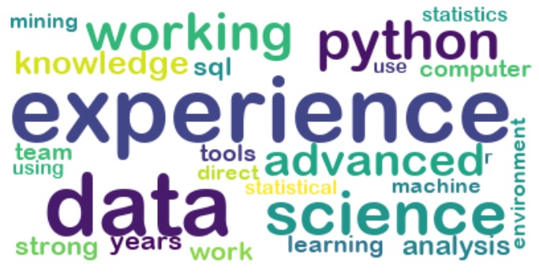

# Project-Web-Scraping-Indeed-Data-Science-Jobs
Data Scientists and statisticians have recently become one of the most fast growing jobs in the last couple of years, due to the increasing value in utilizing big data. Many different companies across various of fields are seeking for data scientists in the job market. Out of curiosity, I want to know what are the most important skills that companies are looking for as data scientists. In this project, I created my own web scrapper and scraped the qualification information from 105 data scientist related job posts near Toronto, ON, Canada on Indeed.com.

## Code and Resouces Used
**Python Version**: 3.7

**Packages**: selenium, BeautifulSoup, pandas, nltk

## Web Scraping
Developed script to scrape over 100 indeed data science jobs. With each job, the following information is scraped:
- Job Title
- Job Requirements

## Key Findings:
- The most frequently mentioned programming languages are Python, SQL, and R. Among the three, Python is the most demanded language. 
- Machine learning and data mining skills are very important. 
- Knowledge and skills in statistics are also explicitly mentioned in many job posts.
- Many companies ask for candidates to have at least three years of working experience, likely in data analysis related fields.
- Besides the hard skills, being able to communicate well with data using presentation is also highly valued in data scientist jobs.

## Word Cloud
The image below is the word cloud generated from my result:

**Please check *Web_Scraping_Indeed_Data_Science.ipynb* for the complete project.**
